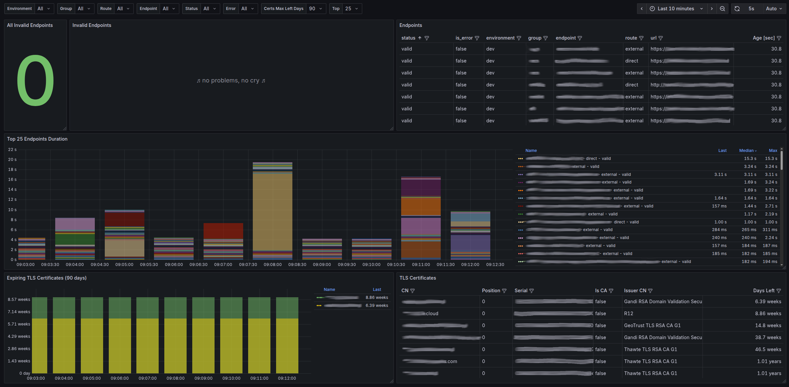

# watchdog_exporter

This `watchdog_exporter` program continuously probes a list of HTTP(S) endpoints through one or more “routes”
(direct connection, an internal proxy, an external proxy, etc.), validates each response against rules you define 
(status code, response headers, body‐regex), and exposes Prometheus metrics about whether each check passed and how long it took.

## Usage

Using [this example config](config.example.yml):

* It listens on **:9321**, serving metrics at **/metrics**.
* It spawns up to **4** concurrent workers, each with a **5s** timeout and a **1KiB** body‐read limit.
* It stamps all metrics with the namespace **watchdog** and a constant label **environment=dev**.
* It defines three routes:
    * **direct** (no proxy),
    * **internal** overriding target-ip to `127.0.0.1` (without change of the `Host` header),
    * **external** via proxy `1.2.3.4:8080`.
* It tests two endpoints:
    1. **example.com** over “direct” and “external” routes, expecting HTTP 200 and a body match `.*Wrong Domain.*`.
    2. **example.org** over all three routes (with a 10 s override timeout), expecting HTTP 200 and `.*Example Domain.*`.

For each (endpoint, route) pair it emits:

1. `watchdog_build_info{program_name,program_version} 1` (a constant gauge=1)
2. `watchdog_endpoint_validation{environment,group,endpoint,protocol,url,route,status} 1` status is "valid" if validation passed (a constant gauge=1)
3. `watchdog_endpoint_duration_seconds{environment,group,endpoint,protocol,url,route,status} X`, where `X` is the round‐trip duration in seconds

Prometheus can then scrape these metrics to track uptime, correctness, and latency of your services across different network paths.

## Grafana dashboard

[grafana-dashboard.json](docs/grafana-dashboard.json)
